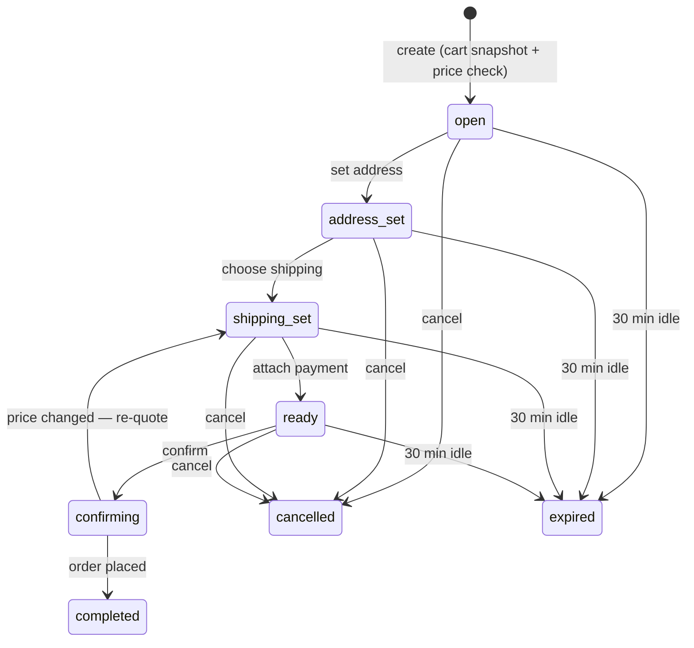

# checkout-service

The checkout counter of the duynhlab shop: when you're ready to buy, this
service walks you through the purchase step by step — your cart is snapshotted
into a **checkout session**, prices are double-checked against the catalog so
the price you see is the price you pay, and once everything looks right the
session is handed to order-service to actually place the order.

Why a whole service for that? Before checkout-service existed, "checkout" was
a single button press straight into order-service. That worked, but prices
could silently go stale between "add to cart" and "buy", there was nowhere to
keep your address or shipping choice between steps, and an interrupted
checkout couldn't resume. The checkout session fixes all three — the full
story lives in [RFC-0015](https://github.com/duynhlab/homelab/tree/main/docs/proposals/rfc/RFC-0015)
and the friendly subsystem guide in
[docs/api/checkout.md](https://github.com/duynhlab/homelab/blob/main/docs/api/checkout.md).

## How a session flows

A session is a short-lived quote (30 minutes) that moves forward through the
funnel one step at a time. You can edit earlier steps (it hops back), cancel
whenever you like, or just walk away — it quietly expires.



`completed`, `cancelled` and `expired` are final. Expiry is belt-and-braces:
a durable Temporal timer (`AbandonedCheckoutWorkflow`, reset on every
activity) does the tidying, and every read/write also lazily checks the
deadline column — so a dead worker delays the bookkeeping, never the
correctness. One nice guarantee: a session that's mid-confirm is never
expired out from under you — it either completes or drops back for a
re-quote.

## What you can call today

Every route needs a logged-in user (JWT — Kong checks it at the edge, the
service verifies it again), and you can only ever see **your own** sessions:
someone else's session id behaves exactly like one that doesn't exist (404).

| Method | Path | What it does |
|--------|------|--------------|
| `POST` | `/checkout/v1/private/checkout/sessions` | Start checking out: snapshots your cart, re-checks every price against the catalog. Creating twice is safe — you get your existing session back (**201** new, **200** existing) |
| `GET` | `/checkout/v1/private/checkout/sessions/:id` | See the session: items, prices, totals, status |
| `PUT` | `/checkout/v1/private/checkout/sessions/:id/address` | Save your shipping address (re-clamps totals if the region's tax differs) |
| `PUT` | `/checkout/v1/private/checkout/sessions/:id/shipping` | Choose a shipping method — the fee is quoted live by shipping-service |
| `PUT` | `/checkout/v1/private/checkout/sessions/:id/payment` | Attach a payment token (`tok_…` only; anything card-number-shaped is rejected before it's ever stored) |
| `POST` | `/checkout/v1/private/checkout/sessions/:id/promo` | Apply a promo code — a validated preview, never a counted use (re-POST replaces it) |
| `DELETE` | `/checkout/v1/private/checkout/sessions/:id/promo` | Remove the code |
| `POST` | `/checkout/v1/private/checkout/sessions/:id/confirm` | Place the order. Requires an `Idempotency-Key` header — retry with the same key and you get the **same** order, never two |
| `DELETE` | `/checkout/v1/private/checkout/sessions/:id` | Cancel the session (your cart is untouched) |

Errors come in the platform envelope `{"error", "code"}`. The ones you'll
actually meet: `409 CONFLICT` (empty cart), `410 SESSION_EXPIRED` (took longer
than 30 minutes — just create a new session), `409 INVALID_TRANSITION` (that
step isn't allowed from the session's current state), `404` (not yours / not
there). Confirm adds a few of its own: `400 IDEMPOTENCY_KEY_REQUIRED`,
`409 PRICE_CHANGED` / `409 STOCK_UNAVAILABLE` (the session dropped back to
`shipping_set` with fresh numbers — show them and let the shopper re-confirm;
the idempotency key is **not** burned), and `409 PROMO_EXPIRED` /
`PROMO_EXHAUSTED` (the code was stripped, totals are honest again). Promo
apply can also answer `404 PROMO_INVALID`.

Also serving: `GET /health`, `GET /ready`, `GET /metrics`.

## The honest-price trick (worth knowing)

Each session line keeps **two** prices: the catalog price right now
(`unit_price_minor` — this is what you'd pay) and the price cart remembered
from when you added the item (`cart_price_minor`). If they differ, the line is
flagged `price_changed: true` so the UI can say "heads up, this changed since
you carted it" — instead of silently charging something you never saw. On the
wire you see dollars (`"unit_price": 29.99`) like every sibling API; inside
the service and between services money is integer cents.

## Who checkout talks to

| Service | How | Why |
|---------|-----|-----|
| cart | gRPC `GetCart` (read-only) | What's in your cart — items and quantities |
| product | gRPC `GetProducts` | The real, current price and stock (skips the browse cache on purpose) |
| shipping | gRPC `GetQuote` | The authoritative shipping fee for your address + method |
| order | gRPC `CreateOrder` | Places the order once you confirm (with subtotal, fee, tax and discount all carried across) — order-service stays the only place orders are created |
| Temporal | SDK (`checkout` task queue) | The abandonment timer; the `worker` subcommand of this same binary runs the workflow |

Nothing calls into checkout except the gateway — it has no gRPC server and no
internal HTTP routes.

## Data

One database (`checkout`): `checkout_sessions` (status, address, totals,
expiry) + `checkout_session_items` (the snapshot), plus `tax_rules` (seeded
per-region basis points), `promo_codes` / `promo_redemptions` (a redemption
is counted **atomically at confirm**, exactly once per session — abandoning a
session never burns a use), and `idempotency_keys` (the pkg/idempotency
ledger behind confirm). Totals are composed in SQL on every money mutation:
`total = subtotal + shipping_fee + tax − discount`, always in integer cents.
A partial unique index guarantees you can only have one active session at a
time — even two double-clicked "create" requests end up sharing one session.

Sessions past their deadline are rejected on **every** read and write
(`410`), whether or not the background expiry timer is running — the deadline
column is the truth, the timer is just the janitor.

## Development

```bash
GOTOOLCHAIN=auto go build ./...
GOTOOLCHAIN=auto go test -race ./...                                       # unit tests
GOTOOLCHAIN=auto go test -tags=integration ./internal/core/repository/...  # real Postgres via Docker
golangci-lint run --timeout=10m
go run ./cmd migrate   # apply the schema migrations
go run ./cmd worker    # the Temporal worker (abandonment timers)
```

Config is all environment variables — the ones you'll touch: `DB_*`,
`AUTH_JWKS_URL`, the four `*_GRPC_ADDR`s (cart/product/order/shipping),
`TEMPORAL_HOSTPORT`, and `SESSION_TTL_SECONDS` (default 1800). The easiest
way to run the whole thing is the platform's
[local-stack](https://github.com/duynhlab/homelab/tree/main/local-stack)
(`docker compose up -d --build` next to the sibling repos) — its README has
ready-made audit scripts (sections A9–A10) that exercise this service end to
end, confirm and promo flows included.

### Availability read path

Checkout reads a basket from **two authorities**, concurrently:

| Answer | Authority | RPC |
|---|---|---|
| price | product-service | `product.v1/BatchGetCurrentPrices` |
| availability | inventory-service | `inventory.v1/CheckAvailability` |

Both are **required constructor dependencies**, not optional wiring, and
`INVENTORY_GRPC_ADDR` is dialled like every other east-west target. There is no
product-availability fallback: RFC-0021 phase 4 removed product's stock branch, and
the column it used to read was frozen at the write cutover — so a fallback could only
ever have answered with a number that was stale by construction. A read that cannot
be right is worse than a read that fails.

The migration machinery that got us here is **gone**: the source flag
(`CHECKOUT_AVAILABILITY_SOURCE`), the shadow compare, the per-user canary dial and
its salt. With one authority there is no path to select, nothing to compare against,
and no exposure to ramp.

**Fail-closed is the rule that survived.** A `CheckAvailability` transport error or
timeout maps to `ErrUpstream` (503, retryable) and *never* to out-of-stock — a
timeout is not a shortage. Same at confirm: an answer that covers nothing we asked
for reads as a degraded upstream, not as a delisted basket.

## Observability

OpenTelemetry everything (traces, RED metrics, logs) pushed via the shared
`pkg/obsx` pipeline; optional Pyroscope profiling. Middleware order is
tracing → logging → metrics, like every sibling service.

## License

MIT
