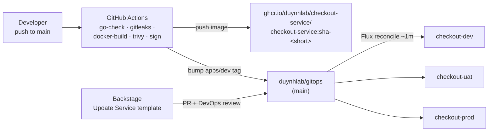

# checkout-service

Checkout pricing API for the duynhlab platform. Go, stateless, follows the
org service conventions (see `duynhlab/auth-service` for the reference layout).

## Delivery pipeline



- **dev** deploys automatically on every merge to `main` (`update-gitops-dev` job).
- **uat / prod** are promoted through Backstage pull requests reviewed by DevOps/SRE.

## API

| Method | Path | Description |
|--------|------|-------------|
| POST | `/api/v1/checkout` | Price a cart: `{"items":[{"sku":"a","quantity":2,"unit_price_cents":1000}]}` |
| GET | `/api/v1/info` | Service identity + effective runtime config (env, version, log level) |
| GET | `/health` | Liveness |
| GET | `/ready` | Readiness (503 while draining during shutdown) |
| GET | `/metrics` | Prometheus metrics |

## Configuration

All configuration is environment-driven (`config/config.go`, validated at startup):

| Group | Variables |
|-------|-----------|
| Service | `SERVICE_NAME` (required), `PORT` (8080), `VERSION`, `ENV` (dev/staging/production) |
| Logging | `LOG_LEVEL` (info), `LOG_FORMAT` (json) |
| Tracing | `TRACING_ENABLED`, `OTEL_COLLECTOR_ENDPOINT`, `OTEL_SAMPLE_RATE`, `OTEL_BATCH_SIZE` |
| Profiling | `PROFILING_ENABLED`, `PYROSCOPE_ENDPOINT` |
| Metrics | `METRICS_ENABLED`, `METRICS_PATH` |
| Database | `DB_*` (supported by config, not used yet — service is stateless) |
| Shutdown | `SHUTDOWN_TIMEOUT` (10s), `READINESS_DRAIN_DELAY` (5s) |

## Local development

```bash
SERVICE_NAME=checkout TRACING_ENABLED=false PROFILING_ENABLED=false go run ./cmd/main.go
curl -s localhost:8080/api/v1/info | jq
curl -s -X POST localhost:8080/api/v1/checkout \
  -d '{"items":[{"sku":"tee","quantity":2,"unit_price_cents":1999}]}' | jq
```

Tests and lint:

```bash
go test -race ./...
golangci-lint run --config=.golangci.yml
```

## Releases

- Merge to `main` → immutable image `sha-<short>` → auto-deployed to dev
- Tag `vX.Y.Z` → semver-tagged image for promotion to uat/prod
