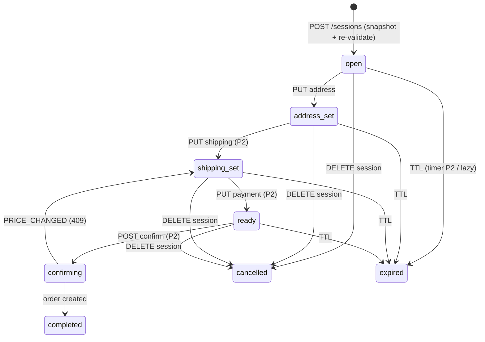

# checkout-service

Checkout session orchestrator (RFC-0015): the service between the SPA and
order-service that owns the multi-step purchase funnel. It snapshots the
user's cart into a short-TTL **checkout session**, re-validates **price and
stock against product-service** (the price authority at checkout time — the
fix for the platform's stale-price gap), and drives an explicit state machine
to the confirm handoff. order-service remains the only orders-writer and
saga-starter.

## Session state machine



`expired` and `cancelled` are terminal. **Lazy-expiry backstop**: every read
and mutation treats `now > expires_at` as expired regardless of the Temporal
timer (P2) — an expired session is never honored, even with the worker down.

## API Endpoints (P1 surface)

Variant A collection-noun paths (naming convention v3.0.0 / ADR-017 —
checkout's registered collection noun is **`sessions`**). All routes
`private`: Kong edge-JWT pre-filters, in-service `pkg/authmw` is
authoritative, sessions are owner-scoped by JWT `user_id`.

| Method | Path | Purpose |
|--------|------|---------|
| `POST` | `/checkout/v1/private/sessions` | Create (201) or return the active session (200 — idempotent); snapshots cart, re-validates prices, flags `price_changed` lines |
| `GET` | `/checkout/v1/private/sessions/:id` | Session + items + totals (owner-scoped) |
| `PUT` | `/checkout/v1/private/sessions/:id/address` | Set shipping address → `address_set` |
| `DELETE` | `/checkout/v1/private/sessions/:id` | Cancel (idempotent on cancelled) |

Shipping/payment/promo/confirm steps land in P2–P4 (RFC-0015 phases).
Errors use the shared envelope `{"error","code"}`; notable codes:
`SESSION_EXPIRED` (410), `INVALID_TRANSITION` (409), `NOT_FOUND` (404 — also
for foreign sessions, anti-IDOR).

Operational endpoints: `GET /health`, `GET /ready` (DB ping + drain-aware),
`GET /metrics`.

## East-west calls (all gRPC, client-only)

| Target | RPC | Why |
|--------|-----|-----|
| cart `:9090` | `cart.v1/GetCart` | Item-list authority: which products, what quantities (+ denormalized price for the diff) |
| product `:9090` | `product.v1/GetProducts` | Price/stock authority at checkout time (cache-bypassing batch read) |

checkout runs **no gRPC server** — nothing dials into it except Kong.

## Money

int64 **minor units** everywhere (RFC-0010 P3 representation). Floats never
cross a service boundary; cart/product convert once at their gRPC boundary.

## Data model

`checkout_sessions` (uuid id, FSM status, jsonb address, money columns,
`expires_at`, `expired_reason` timer|lazy) + `checkout_session_items`
(snapshot: `unit_price_minor` from product, `cart_price_minor` from cart,
`price_changed`). One active session per user via a partial unique index.

## Development

```bash
GOTOOLCHAIN=auto go build ./...
GOTOOLCHAIN=auto go test -race ./...                                       # unit
GOTOOLCHAIN=auto go test -tags=integration ./internal/core/repository/...  # real Postgres (Docker)
golangci-lint run --timeout=10m
go run ./cmd migrate   # apply embedded schema migrations
```

Key env: `PORT` (8080), `DB_*`, `AUTH_JWKS_URL`, `JWT_ISSUER`/`JWT_AUDIENCE`,
`CART_GRPC_ADDR`, `PRODUCT_GRPC_ADDR`, `SESSION_TTL_SECONDS` (1800),
`TRACING_ENABLED`, `OTEL_COLLECTOR_ENDPOINT`, `PROFILING_ENABLED`.

## Observability

`pkg/obsx` OTLP push (RFC-0014): traces + RED metrics + teed logs; middleware
chain **tracing → logging → metrics**; Pyroscope profiling optional.

## License

MIT
